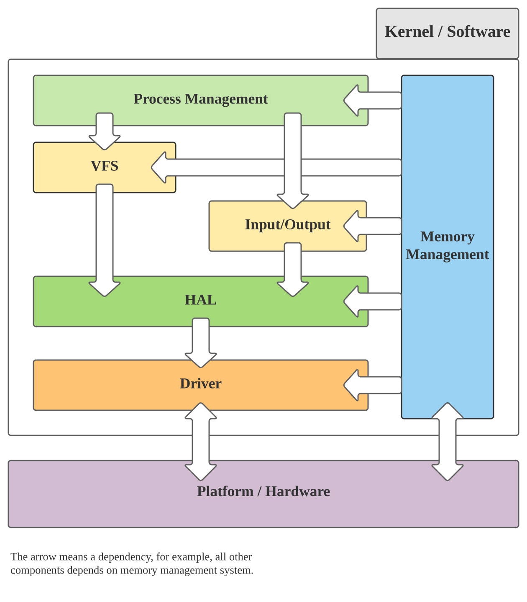
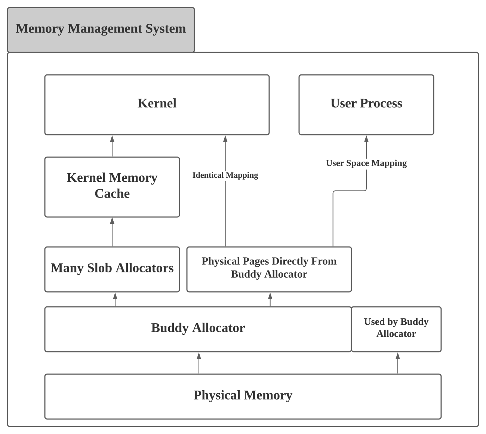
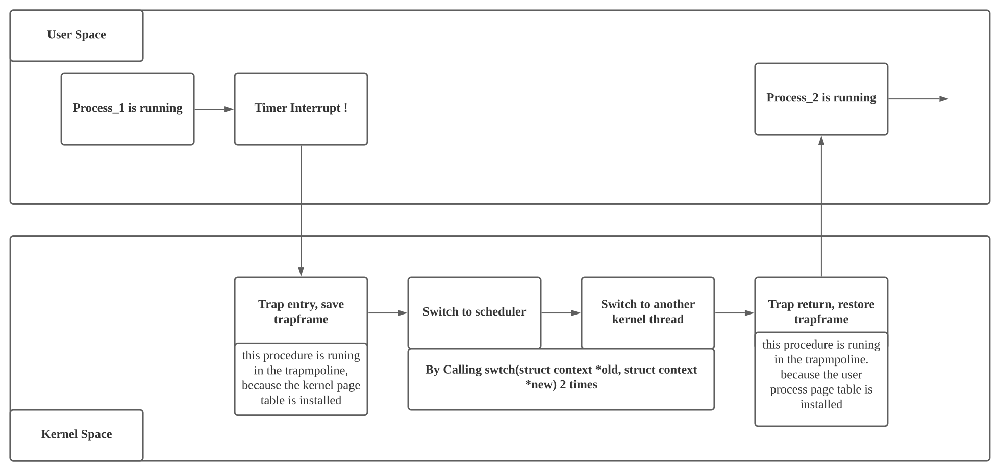
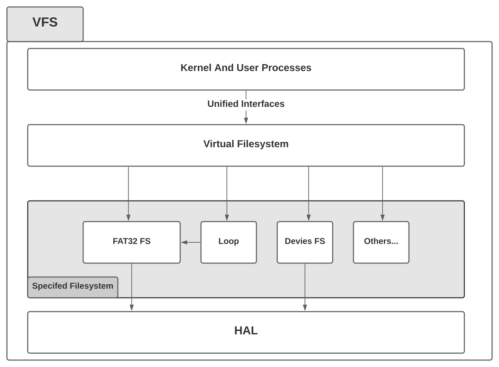

# ZGMOS Documentation 

---

# Ch.1 概述

## 1.1 项目综述

ZGMOS项目是全国大学生计算机系统能力大赛，操作系统赛，内核赛道的参赛作品。本项目目前**从零**实现了一个简单的，xv6风格的宏内核，目前可以在QEMU以及K210平台上运行。

(文档推荐使用网页浏览，Markdown导出PDF的分页不是很理想)

## 1.2 内核实现框架以及模块

内核主要分为如下四个模块：

1. 内存管理
2. 进程管理
3. 文件系统
4. 硬件虚拟层和驱动

系统架构图如下：



### 1.2.1 内存管理

在ZGMOS中，内存管理部分我们主要使用了一个伙伴分配器（Buddy Allocator）和一个简易的，类似于Slob的较小粒度的内存分配器(下面以slob来指代），以及一个内核内存缓冲模块来对slob对象进行统一管理。伙伴系统的最小分配粒度是一个最小页的大小,为4KiB，而slob的分配粒度最小是16Bytes。内存管理是在整个系统中最早进行初始化的模块，其他所有模块都依赖于内存管理模块。

### 1.2.2 进程管理

在ZGMOS中，进程管理部分我们主要实现了系统的多进程功能，能够从标准的ELF文件中读入可执行文件，装入内存中并进入用户态进行运行，并通过时钟中断来进行抢占。Context Switch的风格与xv6类似，内核和用户进程分别拥有一个中断Handler,通过一个跳板页面来从用户态进入内核态，并在内核态里面进行上下文切换，一般是切换到调度器进程，并由调度器选择下一个进程进行运行。目前，我们只实现了一个简单的轮转式的调度器，不过预留了相关接口。所有进程的实体（struct task_struct），根据其进程状态不同，分别通过几个链表进行相连，调度器的任务就是从某个链表中取出一个进程实体，取出的实体会被运行。

### 1.2.3 文件系统

在ZGMOS中，文件系统分为了两层，下层是具体的，面向具体数据存储结构与组织方式的文件系统，例如本次比赛指定的FAT32，亦或者是一个设备文件系统、一个loop文件等等。上层是一个虚拟文件系统（VFS），VFS将对具体的文件系统的操作进行封装与抽象，对用户进程提供服务，将用户进程的请求代理给下层的文件系统。

### 1.2.4 硬件虚拟层和驱动

由于本次比赛要在两个平台上进行开发，我们就设计了一个硬件虚拟层（HAL）用来封装平台上的硬件差异，方面后续的开发。主要设计两个抽象硬件，一个是UART，另一个是存储设备。对于存储设备，在K210平台，存储设备是SPI接口的存储卡，而在QEMU上，存储设备是Virtio Block设备，而我们的下层文件系统只会依赖于虚拟的硬件，屏蔽了硬件差异，类似于设计模式中的Adapter模式。

## 1.3 项目进度
基本的内核框架已经完成，除去驱动部分，github commits记录的代码行数达到了13000+，但目前实现的系统调用数目有限，仅能通过个别测试用例，目前剩余的工作主要是实现系统调用。

---

# Ch2. 内存管理

内存管理系统的架构图：




## 2.1 伙伴系统 Buddy Allocator

伙伴系统，或者叫做伙伴分配器，是一个常用的物理内存分配算法。在ZGMOS中，伙伴系统是最底层的内存分配设施，负责对物理内存进行分配。简易Slob也依赖于伙伴系统。本项目的实现方法是使用了多个以数组表示的完全二叉树(因为真实的物理内存页数并不是二次幂，所以是多个完全二叉树），在稳定性上，本项目实现的伙伴分配器通过了压力测试，没有出现问题，在速度上，实现中没有任何递归（在内核中最好不要有递归），分配和释放的时间复杂度都是`O(logN)`，N为物理内存的页数。

伙伴系统的分配调用`buddy_alloc()`会被`pmem_alloc()`封装。在这里，我们增加了一个抽象层，目的是为了维护需要，如果需要更换物理内存分配器，只需要修改`pmem_alloc()`系列函数即可。

具体实现：
> kernel/buddy.c kernel/buddy.h

## 2.2 Slob Allocator

简易Slob是在ZGMOS中，我们实现的一个小细粒度内存分配器，该分配器从伙伴系统中取得页，并将这些页切割，分成更小的内存块进行分配，每个内存块的大小可以从16字节到2048字节，大于2048字节的内存块应该直接使用伙伴系统进行分配。

每个slob对象在初始化的时候，都会被被指定一个特定的分配大小，slob只可以分配该大小的内存空间。所以需要多个slob来进行分配。对于内核中经常被使用到的对象的大小，我们应该指定给一个slob分配器。除此之外，我们还需要一个slob的管理设施来对slob进行管理，这就引出了内核内存缓存。

具体实现：
> kernel/slab.c kernel/slab.h

## 2.3 内核内存缓存 Kernel Memory Cache

内核内存缓存是用来管理slob的设施，所有slob对象是从一个静态的slob对象那里分配得到的。而这些真正用于内核对象的slob对象被挂在一个链表上， 内核内存缓存对内核中的其他模块暴露一个`kmem_alloc()`的接口，而这个接口又被`kmalloc()`封装 。

内核中的其他模块间接调用`kmem_alloc()`时，内存内核缓存就会根据大小匹配合适的slob对象，并从这个slob对象中取得相应的内存块。如果发现当前的slob没有符合条件的，那就重新申请一个slob，并进行分配。

内核中的其他模块间接调用`kmem_free()`时，内存内核缓存根据标记直接选择相应的slob对象，将内存归还,归还的内存只会放到slob中，除非调用了`kmem_shrink()`，空闲内存不会被释放给伙伴系统。目前，由于时间关系，我们还没有在这个地方实现真正的内存缓存以及每个核心独立占有的内核对象缓存。

与物理内存分配器的设计思路相同，我们在这个地方进行一个封装的原因也是为了解耦，如果我们实现了更好的内存分配器，我们可以通过这个抽象层，很简单的进行切换。

具体实现：
> kernel/kmem.c kernel/kmem.h

---

# Ch3. 进程管理

## 3.1 进程的调度

ZGMOS实现的进程上下文切换的方法与xv6较为类似，切换只可能发生在内核态，每次切换需要重新进入调度器进程，让调度器来选择下一个运行的进程。



相关实现：
> kernel/process.c kernel/scheduler.c 

## 3.2 进程的创建与销毁

目前ZGMOS使用`task_create()`函数调用来从一个标准ELF文件中构建用户程序所需要的内存映像以及相关的内核数据结构，并将`trapframe`中的`kernel_epc`设置为程序运行的起始地址。在该进程被调度器调度时，内核态的中断返回指令`sret`将`spec`加载到`PC`，整个系统进入用户态，运行用户进程。

相关实现：
>kernel/process.c kernel/scheduler.c kernel/uvec.c kernel/uvec_asm.s


## 3.3 系统调用的实现

当用户程序执行了`ecall`指令后，CPU陷入到中断处理函数中，用户的中断处理函数是`uvec_asm`，是写在汇编文件中，放在一个跳板页面里面，目的是为了切换页表。该函数将用户态的通用寄存器状态进行保存，放入到`trapframe`中，随后的真正的处理函数可以根据`trapframe`中的寄存器数据来判断调用了哪个系统调用，然后进行相应的处理。系统调用的返回值会放入到`trapframe`中，在用户中断返回时，返回值会被放入到`a0`寄存器，这样就完成了一次系统调用。

相关实现：
> kernel/uvec.c, kernel/uvec_asm.s, kernel/syscall.c

---

# Ch4. 文件系统

文件系统的设计采用了一种适配器模式，具体文件系统将各种操作暴露给虚拟文件系统，而这些操作都是事先指定好的。如果具体文件系统实现了这些操作中的一部分，那么就可以挂载到虚拟文件系统当中。



## 4.1 具体文件系统

目前ZGMOS实现的典型具体文件系统有一个，就是FAT32文件系统，支持FAT32文件的相关操作。除此之外ZGMOS还实现了一个简单的设备文件系统，支持用户进程将数据写入到串口之中。FAT32文件系统的相关内容在本文档中就不赘述了。

具体实现：
> kernel/fat32.c kernel/fat32.h

## 4.2 虚拟文件系统 VFS

虚拟文件系统的作用是统一整个用户操作接口，整个系统所有的、与文件系统相关的操作，都会通过VFS的代理。内核的其他部分和用户进程不必考虑具体操作的文件系统，虚拟文件系统将各种操作代理给后端的具体文件系统。同时自行配备了一个以页大小为粒度的缓冲设施，主要是为了系统速度考量，减少IO调用的次数。

每个文件对象（包括文件，目录，设备文件，或是一个挂载点等等），在VFS中被表述成了一个`vnode`，在程序中的实体是`struct vnode`，由于时间仓促（没时间实现一个红黑树）而且具体文件系统使用的是FAT32文件系统，没办法直接在文件系统中存储`inode`号，所以我们没有采用那种类似于`inode`的索引方式（以一个数字进行索引），我们采用的是具体的目录结构，采用路径进行索引，每个`vnode`都会支持一定的操作，对于文件类型的`vnode`我们可以对其进行读写，对一个目录类型的`vnode`我们可以对其进行`iterate`操作，来遍历其中的内容。

具体实现：
> kernel/vfs.c kernel/vfs.h

## 4.3 文件系统前后端的连接

具体的文件系统通过实现如下的一个借口来为VFS提供服务：

```c
// vfs.h
struct vfs_backend {
  // all the functions below return int as error code
  // 0 for success, other for failures.

  struct list_head list;

  // lower file system or specifed file system
  void *lfs;
  uint64_t lfs_obj_size;

  //  get root object
  int (*root)(void *lfs, void *lobj);

  // create a file, return error code
  int (*create)(void *lfs, void *p_lobj, char *name);

  // delete the file
  int (*unlink)(void *lfs, void *lobj);
  
  // flush the whole fs
  int (*flush)(void *lfs);

  // make a dir
  int (*mkdir)(void *lfs, void *p_lobj, char *name);

  // remove a dir
  int (*rmdir)(void *lfs, void *p_lobj, void *lobj);

  // read from file
  uint64_t (*read)(void *lfs, void *lobj, uint64_t offset, void *buf, uint64_t buf_len);

  // write to file
  uint64_t (*write)(void *lfs, void *lobj, uint64_t offset, void *buf, uint64_t buf_len);

  int (*trunate)(void *lfs, void *lobj, uint64_t new_sz);
  int (*enlarge)(void *lfs, void *lobj, uint64_t new_sz);

  // get file size
  uint64_t (*size)(void *lfs, void *lobj);

  // get file name
  char *(*name)(void *lfs, void *lobj);

  // get file type
  uint32_t (*type)(void *fs, void *lobj);
  
  // iterate through directories
  // while the iterate , this function will fill the memory to which the obj points
  void *(*iterate)(void *lfs, void *dir_obj, void *iter_obj, void *lobj);

  // end the iterate, release the resources
  void (*end_iterate)(void *lfs, void *iter_obj);

  void (*lock)(void *lfs);
  void (*unlock)(void *lfs);
};


```
具体的文件系统只需要实现上述的一部分操作，即可挂载到VFS当中。

## 4.4 虚拟文件系统缓冲 VFS Buffer

我们在虚拟文件系统中实现了一个以页大小为粒度的缓冲设施。基本设计是采用了一个页缓冲池，当有文件被使用时，一个页会绑定到一个文件的某个位置上，对文件的读写就简化成了对内存的操作，大大增加了系统的运行速度。当然，缓冲池的大小是有限的，我们采用LRU算法来进行页面置换，在具体的实现上，我们使用了一个链表结构来实现LRU。如果用户进程再次打开了一个没有缓冲的文件而且VFS从伙伴系统那里分配到的内存已经用光了，那么就要对之前最近没有被使用过的页进行解绑定操作并进行一次或者多次IO操作，将某个文件内容的更新写入到后端的具体文件系统上，该页面就可以用来为新的文件进行缓冲。

VFS的缓冲也可以关闭，让后端的具体文件系统来管理系统的缓冲。

未来ZGMOS应该实现一个完整的，独立于文件系统的缓冲设施，方便同意管理同时可以实现系统内存的swaping。

具体实现：
> kernel/vfs.c kernel/vfs.h

---

# Ch5. 硬件虚拟层和驱动

这一章的相关源代码均放在`hal`文件夹中。

## 5.1 硬件虚拟层，HAL

### 5.1.1 UART
串口的硬件虚拟层非常简单，只需要在 `uart_hal.c` 文件中实现相关的操作，通过条件编译来达到对于不同的硬件平台，进行不同的操作的目的。

```c
#ifndef __UART_HAL_H_
#define __UART_HAL_H_

void uart_hal_init();
void uart_hal_send(char ch);
char uart_hal_recv();

#endif // __UART_HAL_H_
```

### 5.1.2 Disk

硬盘IO的操作同样非常简单。

```c
#ifndef __DISK_HAL_H_
#define __DISK_HAL_H_

#include <stdint.h>
#include <stdbool.h>

struct disk_hal;

typedef bool(*disk_hal_read_func)(struct disk_hal *params, uint64_t sector, void *buf);
typedef bool(*disk_hal_write_func)(struct disk_hal *params, uint64_t sector, void *buf);

struct disk_hal_ops {
  disk_hal_read_func read_op;
  disk_hal_write_func write_op;
};

struct disk_hal {
  void *dev;
  uint64_t len;
  struct disk_hal_ops ops;
};

struct disk_hal *disk_hal_init();
bool disk_hal_read(struct disk_hal *disk, uint64_t sector, void *buf);
bool disk_hal_write(struct disk_hal *disk, uint64_t sector, void *buf);
bool disk_hal_destory(struct disk_hal *disk);
#endif // __DISK_HAL_H_
```

## 5.2 硬件驱动

### 5.2.1 QEMU Virt 平台

主要实现了两个设备驱动，这两个设备分别是`NS16550`和`Virtio Block device`。相比于原版的`xv6`系统，我们本次实现的`Virtio Block`驱动采用了非Legacy接口，算是一个改进之处。

### 5.2.2 K210 平台

K210平台的驱动主要移植于Kendryte的官方SDK与`xv6-k210`项目。在此感谢`xv6-k210`的开发者，他们的工作给了我们巨大的帮助。


---

# Ch6. 基础设施

在该章节，我们将介绍在ZGMOS中所用到的一些基础的数据结构和函数，以及在开发过程中的Debug技巧。

## 6.1 "kustd" : Kernel Macro 'std' Library

一些非常基本的库函数的实现，类似于`memcpy()`之类的经常被用到的库函数。

## 6.2 Utils

一些没有在标准库中，但是却很有用的内容。例如一些用来进行对齐的宏。
```c
// utils.h
#define POWER_OF_2(p) (((uint64_t)1 << (p)))

// n is number of '1' in binary number
// ALL_ONE_MASK(12) = POWER_OF_2(12) - 1
//                  = 4096 - 1
//                  = 4095 = 1111_1111_1111b
#define ALL_ONE_MASK(n) ( POWER_OF_2(n) - 1 )

#define ALIGN_XBITS(a, n) ( ((uint64_t)(a)) & ( ~ALL_ONE_MASK(n) ) )

#define ALIGN_4K(a) (ALIGN_XBITS(a, 12))
#define ALIGN_2M(a) (ALIGN_XBITS(a, 21))
#define ALIGN_1G(a) (ALIGN_XBITS(a, 30))
```

## 6.3 一些常用的内核数据结构

1. `struct list_head`，Linux内核中经典的循环双链表实现。

2. `struct bitmap`，简单的位图实现，可以用来分配文件描述符FD和进程号PID

## 6.4 RISC-V 页表操作

操作页表是内核必须实现的功能，所以我们实现了一系列页表操作函数，附带一个简单的单元测试（单元测试没有体现在下面的内容中）

```c
// pte.h

// PTE library only operates on the bits in pte_t(uint64_t)
// Simply say, It can run on any platfrom, it only access memory
// Surely, only on RISC-V, it is not meaningless

// page size enum
enum {
  PTE_PAGE_4K,
  PTE_PAGE_2M,
  PTE_PAGE_1G
};

#define VA_VPN(va)  ( ((uint64_t)(va) >> 12) & ALL_ONE_MASK(27))
#define VA_VPN2(va) ( ((uint64_t)(va) >> 30) & ALL_ONE_MASK(9))
#define VA_VPN1(va) ( ((uint64_t)(va) >> 21) & ALL_ONE_MASK(9))
#define VA_VPN0(va) ( ((uint64_t)(va) >> 12) & ALL_ONE_MASK(9))

#define PA_PPN(va)  ( ((uint64_t)(pa) >> 12) & ALL_ONE_MASK(44))
#define PA_PPN2(va) ( ((uint64_t)(pa) >> 30) & ALL_ONE_MASK(9))
#define PA_PPN1(va) ( ((uint64_t)(pa) >> 21) & ALL_ONE_MASK(9))
#define PA_PPN0(va) ( ((uint64_t)(pa) >> 12) & ALL_ONE_MASK(9))

// pte_t is just a uint64_t, pretty simple
pte_t *pte_create();

// Do not remap or cause any address overlap, or you will run into trouble
// flags could be :
// PTE_X_SET, PTE_R_SET, PTE_W_SET, PTE_V_SET, PTE_U_SET and their 'or' combination
// page_size is the enum below
void pte_map(pte_t *p, void *va, void *pa, uint64_t flags, int page_size);

// length is in bytes
void pte_range_map(pte_t *p, void *va, void *pa, uint64_t flags, uint64_t length);

// auto select the page size
// alignment is not check insied the function
void pte_unmap(pte_t *p, void *va);

void pte_range_unmap(pte_t *p, void *va, int64_t length);

// flags, and page_size will be written in this function if not NULL
void *pte_walk(pte_t *p, void *va, uint64_t *flags, int *page_size);
```

## 6.5 OpenOCD or QEMU + GDB 的调试设施

我们使用了GDB可以加载Python脚本的特性，将各种GDB调试时的操作进行简化，去除了很多没有必要的重复工作。

```python
# scripts/gdbinit.py
import gdb

def main():
    gdb.execute('target extended-remote localhost:3008')
    gdb.execute('b _debug_stub')
    gdb.execute('b main')
    gdb.execute('c')
    gdb.execute('layout split')

if __name__ == "__main__":
    main()
```

我们还使用了一些条件编译的trick，在Linker Script里面做手脚，实现了让K210平台启动时在内核入口处进行空转（QEMU平台则不受影响，因为QEMU的GDB Stub可以直接被Halt），方便JTAG调试器及时地在内核运行前Halt住CPU。

---

# Ch7. 开发中遇到的Bug与难题

## 7.1 Linker Script
当我们在使用 MEMROY 命令时，各个段不能直接进行4K对其，否则除了程序段，剩下的所有段都会被链接器放入到`.bss`段中。我曾在多个论坛求助，但最终没能得到解答，目前该问题还是没有得到解决。具体可以参见以下链接(需要梯子)：

[Reddit Thread : A question about linker script: when sections paged aligned, data and rodata both are put into bss...](https://www.reddit.com/r/osdev/comments/n7loq6/a_question_about_linker_script_when_sections/)

如果抛去前提，不使用MEMORY命令，那么4K对其就是很简单的事情了。但是这个问题根本上是没有得到解决的。

## 7.2 SPI与DMA的驱动问题

由于K210的文档不全而且我们对于这些硬件内容也不太熟悉，所以直接使用了`xv6-k210`项目的驱动，我们希望可以尝试自己移植官方SDK的驱动过来，但是有点困难。

---

# Ch8. 项目总结

ZGMOS项目的开发时间大概为一个月。由于项目进度管理出现了一些问题，ZGMOS目前能运行通过的系统调用还很少，处在一个需要增加系统调用的阶段。

不过，重要的是我们在开发过程中学到了很多。在开发之前我们对于`xv6`还不甚熟悉，对于Linux仅限于使用，但是现在我们对于`xv6`的整体架构有了非常清晰的认识和理解，学习了Linux中的一部分优秀设计。在整个开发的过程中学到了非常多的内容，上到对于操作系统本质的认识，下到对ELF格式的理解。对于进程的上下文切换过程不再云里雾里，理解了为什么每个进程都有一个内核栈，认识到文件系统在某种层面上来说是一种数据组织形式。

不管能不能通过初赛，本项目都会继续进行开发，计划未来使用Rust进行重写。

ZGMOS, A simple toy Kernel in FOUR WEEKS~

*2021/5/31*

---

# Ch9. 第二阶段

## 9.1 BusyBox介绍

### 9.1.1 BusyBox简介

  BusyBox 是一个集成了三百多个最常用Linux命令和工具的软件。BusyBox 包含了一些简单的工具，例如ls、cat和echo等等，还包含了一些更大、更复杂的工具，例grep、find、mount以及telnet。有些人将 BusyBox 称为 Linux 工具里的瑞士军刀。简单的说BusyBox就好像是个大工具箱，它集成压缩了 Linux 的许多工具和命令，也包含了 Linux 系统的自带的shell。

### 9.1.2 BusyBox发源

BusyBox 最初是由 Bruce Perens 在 1996 年为Debian GNU/Linux安装盘编写的。其目标是在一张软盘上创建一个可引导的 GNU/Linux 系统，这可以用作安装盘和急救盘。

### 9.1.3 BusyBox编译安装

```
#make defconfig [1] 
#make
#make install
编译好后在busybox目录下生成子目录_install,里面的内容:
drwxr-xr-x 2 root root 4096 11月 24 15:28 bin
rwxrwxrwx 1 root root 11 11月 24 15:28linuxrc -> bin/busybox
drwxr-xr-x 2 root root 4096 11月 24 15:28 sbin
其中可执行文件busybox在需要制作文件系统映像烧入板子的情况下，busybox应放在根文件系统目录下的bin中，其他的都是指向他的符号链接.
```

### 9.1.4 BusyBox交叉编译

要实现交叉编译，需要设置好交叉编译器前缀，可以使用以下命令设置前缀：
\#make CROSS_COMPILE=arm-linux-uclibcgnueabi-
或者，可以由环境变量设置CROSS_COMPILE的值，CROSS_COMPILE的默认值不是可执行文件的前缀。

### 9.1.5 BusyBox配置

busybox的配置程序和linux内核菜单配置方式简直一模一样.熟悉用make menuconfig方式配置linux内核的朋友很容易上手.
```
\#cp busybox-1.00.tar.gz /babylinux
\#cd /babylinux
\#tar xvfz busybox-1.00.tar.gz
\#cd busybox-1.00
\#make menuconfig
下面是需要编译进busybox的功能选项。
General Configuration应该选的选项
Show verbose applet usage messages
Runtime SUID/SGID configuration via /etc/busybox.conf
Build Options
Build BusyBox as a static binary (no shared libs)
```
这个选项是一定要选择的,这样才能把busybox编译成静态链接的可执行文件,运行时才独立于其他函数库.否则必需要其他库文件才能运行,在单一个linux内核不能使它正常工作.
```
Installation Options
Don't use /usr
```
这个选项也一定要选,否则make install 后busybox将安装在原系统的/usr下,这将覆盖掉系统原有的命令.选择这个选项后,make install后会在busybox目录下生成一个叫_install的目录,里面有busybox和指向它的链接.
其它选项都是一些linux基本命令选项,自己需要哪些命令就编译进去,一般用默认的就可以了，配置好后退出并保存。

### 9.1.6 BusyBox使用技巧

可以这样用busybox
```
#busybox ls
```
他的功能就相当运行ls命令
最常用的用法是建立指向busybox的链接,不同的链接名完成不同的功能.
```
#ln -s busybox ls
#ln -s busybox rm
#ln -s busybox mkdir
```
然后分别运行这三个链接:
```
#./ls
#./rm
#./mkdir
```
就可以分别完成了ls rm 和mkdir命令的功能.虽然他们都指向同一个可执行程序busybox，但是只要链接名不同,完成的功能就不同，很多linux网站都提供busybox的源代码下载。

## 9.2 Lua介绍

### 9.2.1 Lua简介

Lua是一个小巧的脚本语言。它是巴西里约热内卢天主教大学（Pontifical Catholic University of Rio de Janeiro）里的一个由Roberto Ierusalimschy、Waldemar Celes 和 Luiz Henrique de Figueiredo三人所组成的研究小组于1993年开发的。 其设计目的是为了通过灵活嵌入应用程序中从而为应用程序提供灵活的扩展和定制功能。Lua由标准C编写而成，几乎在所有操作系统和平台上都可以编译，运行。Lua并没有提供强大的库，这是由它的定位决定的。所以Lua不适合作为开发独立应用程序的语言。Lua 有一个同时进行的JIT项目，提供在特定平台上的即时编译功能。
Lua脚本可以很容易的被C/C++ 代码调用，也可以反过来调用C/C++的函数，这使得Lua在应用程序中可以被广泛应用。不仅仅作为扩展脚本，也可以作为普通的配置文件，代替XML,ini等文件格式，并且更容易理解和维护。 Lua由标准C编写而成，代码简洁优美，几乎在所有操作系统和平台上都可以编译，运行。一个完整的Lua解释器不过200k，在所有脚本引擎中，Lua的速度是最快的。这一切都决定了Lua是作为嵌入式脚本的最佳选择。 

### 9.2.3 保存和运行
运行可以通过 Lua 的交互模式，也可以用记事本编辑代码保存为 .lua 的格式,通过 Lua 编译器运行。也可以通过第三方工具，将 Lua 打包独立运行。

### 9.2.4 目标

Lua的目标是成为一个很容易嵌入其它语言中使用的语言。大多数程序员也认为它的确做到了这一点。
很多应用程序、游戏使用LUA作为自己的嵌入式脚本语言，以此来实现可配置性、可扩展性。这其中包括魔兽世界、博德之门、愤怒的小鸟、QQ三国、VOCALOID3、Garry's Mod、太阳神三国杀、游戏王ygocore和饥荒等。

### 9.2.5 特性

#### 轻量级

Lua语言的官方版本只包括一个精简的核心和最基本的库。这使得Lua体积小、启动速度快，从而适合嵌入在别的程序里。5.0.2版的Lua的内核小于120KB，而Python的内核大约860KB，Perl的内核大约1.1MB。

#### 可拓展

Lua并不象其它许多"大而全"的语言那样，包括很多功能，比如网络通讯、图形界面等。但是Lua提供了非常易于使用的扩展接口和机制：由宿主语言(通常是C或C++)提供这些功能，Lua可以使用它们，就像是本来就内置的功能一样。

#### 其它特性

Lua还具有其它一些特性：同时支持面向过程(procedure-oriented)编程和函数式编程(functional programming)；自动内存管理；只提供了一种通用类型的表（table），用它可以实现数组，哈希表，集合，对象；语言内置模式匹配；闭包(closure)；函数也可以看做一个值；提供多线程（协同进程，并非操作系统所支持的线程）支持；通过闭包和table可以很方便地支持面向对象编程所需要的一些关键机制，比如数据抽象，虚函数，继承和重载等。

### 9.2.3 应用场景

游戏开发
独立应用脚本
Web 应用脚本
扩展和数据库插件如：MySQL Proxy 和 MySQL WorkBench
安全系统，如入侵检测系统

### 9.2.4 实例代码

是的，你猜对了：Hello,world!
```lua
print"Hello,world!"
```
一个比较复杂一点的例子，但是它展示了什么是闭包:
```lua
function create_a_counter()
    local count=0
    return function()
        count = count + 1
        return count
    end
end
```
create_a_counter()返回一个记数器，每次调用这个记数器，都会得到一个比上次大1的值。
注意：调用的时候，如果你的调用是这样的：
```lua
print(create_a_counter())
```
那么每次输出是一样的结果，没有计数的效果，只会输出计数器的地址，应该这样调用：
```lua
ct = create_a_counter()
print(ct()) --输出> 1
print(ct()) --输出> 2
```
#### 数据交换
#####介绍
Lua和C程序通过一个栈交换数据: struct lua_State
栈的序号可以从栈顶和栈底计数，从栈底计数，则栈底是1,向栈顶方向递增。从栈顶计数，则栈顶是-1,向栈底方向递减。一般都用从栈底计数的方式。栈的默认大小是20，可以用lua_checkstack修改.用lua_gettop则可以获得栈里的元素数目。并不是说在栈顶有一个整形元素。而是计算了一下栈顶元素在栈里的正index,相当于元素数目。
Lua 调用C函数用的栈是临时的，调用结束之后就被销毁了。
如何从栈中获取从Lua脚本中的参数
如果知道Lua脚本中某个全局变量的名字，可以用
```c
void lua_getglobal(lua_State *L, const char *name)
```
这个函数会将name所指Lua变量的值放在栈顶.
如果是在C 函数中要获取Lua调用函数使用的参数：
首先用lua_gettop检查参数数量
用lua_is 类函数检测参数的类型，做好错误处理
用lua_to 类函数将参数转换为number或者string。(对Lua来说，只有这两种简单类型)
```
lua_tonumber返回的是double
lua_tostring返回的是char*
```
用lua_remove从栈中删除掉元素
继续获取下一个元素。 因为每次都调用lua_remove,所以每次调用lua_tonumber,使用的index都将固定是-1，即栈顶。
如果lua_istable成立，那么说明栈顶是一个table 注意 tabl e是不能取出来的，只能把 table 里的元素一个个取出来。
首先把元素的名字压入栈顶：
```c
lua_pushstring(L, "i");
```
然后就可以用lua_gettable调用，值会放在栈顶。同时刚才压入的元素名字被弹出。用上面的办法，可以把这个值取出来。记得也应该lua_remove。 如果table的某一个元素也是table，重复即可。当table的所有元素都取完了，记住这个table本身还在栈里，要用lua_remove把它删除。
如果要获取的是一个数组(所谓数组，其实就是key是从1开始的数字序列的table,并且值类型相同),用lua_next可以遍历这个数组：
首先lua_pushnil，压入一个空值，然后
```c
while(lua_next(L, -2)!=0)
{
    if(lua_isnumber(L, -1))//判断元素类型，也可能是string
    {
        arrf.add((float)lua_tonumber(L, -1));//获取元素的值
        lua_remove(L, -1);
    }
}
lua_remove(L,-1);//删除NIL
```
如何从C返回数据给Lua脚本
用 lua_push 类函数压入数据到栈中，并用return n;来告诉Lua返回了几个返回值。 Lua是天生支持多个返回值的，如
```c
x,y = Test()
```
Lua会根据n从栈里取相应的数据。
如果要返回一个table:
```c
lua_newtable(L);            //创建一个表格，放在栈顶
lua_pushstring(L,"mydata"); //压入key
lua_pushnumber(L,66);        //压入value
lua_settable(L,-3);         //弹出key,value，并设置到table里面去
lua_pushstring(L,"subdata");//压入key
lua_newtable(L);            //压入value,也是一个table
lua_pushstring(L,"mydata"); //压入subtable的key
lua_pushnumber(L,53);
valuelua_settable(L,-3);    //弹出key,value,并设置到subtable
lua_settable(L,-3);         //这时候父table的位置还是-3,弹出key,value(subtable),
                            //并设置到table里去
lua_pushstring(L,"mydata2");//同上
lua_pushnumber(L,77);
lua_settable(L,-3);
return 1;
 
//栈里就一个table其他都被弹掉了。如果要返回一个数组，
//用如下代码：(注意那个关于trick的注释，我在等官方的解释。
//经过验证，这个问题只在windows版本调用dll中方法的时候出现。WinCE正常)
lua_pushstring(L,"arri");
lua_newtable(L);
{
    //atrick:otherwisetheluaenginewillcrash.ThiselementisinvisibleinLuascript
    lua_pushnumber(L,-1);
    lua_rawseti(L,-2,0);
    for(int i=0; i<arri.size(); i++)
    {
        lua_pushnumber(L, arri);
        lua_rawseti(L, -2, i+1);
    }
}
lua_settable(L,-3);
```
这样产生的数组可以在Lua中如下遍历：
```
for i,v in ipairs(data.arri)
do
    print(v)
end
```
或者是
```
for i=1,table.getn(data.arri)
do
　print(data.arri)
end
```
只有数组才能这样，name,value构成的Record不行，table.getn也只对数组有效。
由于上述代码的高度相似性，所以很容易实现自动生成这些代码。比如，根据C的一个struct定义：
```c
typedef enum{BR_9600,BR_4800,}BaudRate;
typedef struct flag
{
    int    onoff;
    int    j;
    long    l;
    double    d;
    char    *name;
    BaudRate    rate;
}flag;
```
可以自动产生如下代码：
```c
bool DataToLua(flagdata, lua_State*L)
{
    lua_newtable(L);
    lua_pushstring(L, "onoff");
    lua_pushnumber(L, （double)data.onoff);
    lua_settable(L, -3);
    lua_pushstring(L, "j");
    lua_pushnumber(L, (double)data.j);
    lua_settable(L, -3);
    lua_pushstring(L, "l");
    lua_pushnumber(L, (double)data.l);
    lua_settable(L, -3);
    lua_pushstring(L, "d");
    lua_pushnumber(L, double)data.d);
    lua_settable(L, -3);
    lua_pushstring(L, "name");
    lua_pushstring(L, data.name.c_str());
    lua_settable(L, -3);
    lua_pushstring(L, "rate");
    lua_pushnumber(L, (double)(int)data.rate);
    lua_settable(L, -3);
    return true;
}
```
LuaToData也是类似的。
如果使用面向对象的方式封装起flag来，把DataToLua变成flag类的一个方法，就更加方便了。

## 9.3 系统调用介绍

### 9.3.1 __NR_setitimer
```c
int setitimer(int which, const struct itimerval *value, struct itimerval *ovalue);
```
which为定时器类型，setitimer支持3种类型的定时器：
**ITIMER_REAL**: 以系统真实的时间来计算，它送出SIGALRM信号。
**ITIMER_VIRTUAL**: -以该进程在用户态下花费的时间来计算，它送出SIGVTALRM信号。
**ITIMER_PROF**: 以该进程在用户态下和内核态下所费的时间来计算，它送出SIGPROF信号。
setitimer()第一个参数which指定定时器类型（上面三种之一）；第二个参数是结构itimerval的一个实例；第三个参数可不做处理。
setitimer()调用成功返回0，否则返回-1。
```c
struct itimerval {
struct timeval it_interval;
struct timeval it_value;
};
struct timeval {
long tv_sec;
long tv_usec;
};
```
it_interval指定间隔时间，it_value指定初始定时时间。如果只指定it_value，就是实现一次定时；如果同时指定 it_interval，则超时后，系统会重新初始化it_value为it_interval，实现重复定时；两者都清零，则会清除定时器。
tv_sec提供秒级精度，tv_usec提供微秒级精度，以值大的为先，注意1s = 1000000us。
ovalue用来保存先前的值，常设为NULL。
如果是以setitimer提供的定时器来休眠，只需阻塞等待定时器信号就可以了。

### 9.3.2  __NR_clock_settime

clock_settime系统调用可以设置系统时间秒数与纳秒数。

```c
 #include <time.h>
 int clock_settime(clockid_t clk_id, const struct timespec *tp);

clockid_t clk_id 用于指定计时时钟的类型，有以下4种：  
            CLOCK_REALTIME:系统实时时间,随系统实时时间改变而改变,即从UTC1970-1-1 0:0:0开始计时,中间时刻如果系统时间被用户该成其他,则对应的时间相应改变  
            CLOCK_MONOTONIC:从系统启动这一刻起开始计时,不受系统时间被用户改变的影响  
            CLOCK_PROCESS_CPUTIME_ID:本进程到当前代码系统CPU花费的时间  
            CLOCK_THREAD_CPUTIME_ID:本线程到当前代码系统CPU花费的时间  

    struct timespect *tp用来存储当前的时间，其结构如下：  
            struct timespec  
            {  
                time_t tv_sec; /* seconds */  
                long tv_nsec; /* nanoseconds */  
            };  
    返回值。0成功，-1失败 
```

### 9.3.3  __NR_clock_gettime

int clock_gettime(clockid_t clk_id, struct timespec* tp);

可以根据需要，获取不同要求的精确时间

参数

**clk_id** : 检索和设置的clk_id指定的时钟时间。
**CLOCK_REALTIME**:系统实时时间,随系统实时时间改变而改变,即从UTC1970-1-1 0:0:0开始计时,
中间时刻如果系统时间被用户改成其他,则对应的时间相应改变
**CLOCK_MONOTONIC**:从系统启动这一刻起开始计时,不受系统时间被用户改变的影响
**CLOCK_PROCESS_CPUTIME_ID**:本进程到当前代码系统CPU花费的时间**CLOCK_THREAD_CPUTIME_ID**:本线程到当前代码系统CPU花费的时间
```c
struct timespec
{
        time_t tv_sec; /* 秒*/
        long tv_nsec; /* 纳秒*/
};
```

### 9.3.4 __NR_syslog

syslog协议属于一种主从式协议：syslog发送端会传送出一个小的文字讯息（小于1024字节）到syslog接收端。接收端通常名为“syslogd”、“syslog daemon”或syslog服务器。系统日志讯息可以被以UDP协议及╱或TCP协议来传送。

Syslog 常被称为系统日志或系统记录，是一种用来在互联网协议（TCP/IP）的网络中传递记录档讯息的标准。这个词汇常用来指实际的syslog 协议，或者那些送出syslog讯息的应用程式或数据库。

通俗一点的讲，syslog就是日志发送和接受的一种协议，你可以使用syslog协议实现自己的应用，将日志通过syslog协议从日志生产者发送到日志消费者，消费者保存日志信息，提供日志查询和管理。

### 9.3.5 __NR_sched_setaffinity

在多CPU系统中，通过sched_setaffinity()可以设置进程的CPU亲和力，使进程绑定在某一个或几个CPU上运行，避免在CPU之间来回切换，从而提高该进程的实时性能。
cpumask.h中定义了4个全局变量来表示CPU的个数：

**cpu_possible_mask**：系统中总的CPU核数，初始化时设置
**cpu_present_mask**： 系统中实际的CPU核数。
**cpu_online_mask **：能被scheduler使用的CPU核数。
**cpu_active_mask** ：能被migration的CPU核数。
如果CONFIG_HOTPLUG_CPU没有被使能，则，
cpu_present_mask=cpu_possible_mask。
cpu_active_mask =cpu_online_mask 。
同时，进程的task_struct中有一个成员cpus_allowed,表示本进程可以在哪些CPU上运行：
```c
struct task_struct {
	volatile long state;	/* -1 unrunnable, 0 runnable, >0 stopped */
	void *stack;
	...
	cpumask_t cpus_allowed;
	...
}
```
sched_setaffinity()的实现在/kernel/sched/Core.c中：
```c
long sched_setaffinity(pid_t pid, const struct cpumask *in_mask)
{
	cpumask_var_t cpus_allowed, new_mask;
	struct task_struct *p;
	int retval;

	rcu_read_lock();

	p = find_process_by_pid(pid);
	if (!p) {
		rcu_read_unlock();
		return -ESRCH;
	}

	/* Prevent p going away */
	get_task_struct(p);
	rcu_read_unlock();

	if (p->flags & PF_NO_SETAFFINITY) {
		retval = -EINVAL;
		goto out_put_task;
	}
	if (!alloc_cpumask_var(&cpus_allowed, GFP_KERNEL)) {
		retval = -ENOMEM;
		goto out_put_task;
	}
	if (!alloc_cpumask_var(&new_mask, GFP_KERNEL)) {
		retval = -ENOMEM;
		goto out_free_cpus_allowed;
	}
	retval = -EPERM;
	if (!check_same_owner(p)) {
		rcu_read_lock();
		if (!ns_capable(__task_cred(p)->user_ns, CAP_SYS_NICE)) {
			rcu_read_unlock();
			goto out_free_new_mask;
		}
		rcu_read_unlock();
	}

	retval = security_task_setscheduler(p);
	if (retval)
		goto out_free_new_mask;


	cpuset_cpus_allowed(p, cpus_allowed);
	cpumask_and(new_mask, in_mask, cpus_allowed);

	/*
	 * Since bandwidth control happens on root_domain basis,
	 * if admission test is enabled, we only admit -deadline
	 * tasks allowed to run on all the CPUs in the task's
	 * root_domain.
	 */
#ifdef CONFIG_SMP
	if (task_has_dl_policy(p) && dl_bandwidth_enabled()) {
		rcu_read_lock();
		if (!cpumask_subset(task_rq(p)->rd->span, new_mask)) {
			retval = -EBUSY;
			rcu_read_unlock();
			goto out_free_new_mask;
		}
		rcu_read_unlock();
	}
#endif
again:
	retval = set_cpus_allowed_ptr(p, new_mask);

	if (!retval) {
		cpuset_cpus_allowed(p, cpus_allowed);
		if (!cpumask_subset(new_mask, cpus_allowed)) {
			/*
			 * We must have raced with a concurrent cpuset
			 * update. Just reset the cpus_allowed to the
			 * cpuset's cpus_allowed
			 */
			cpumask_copy(new_mask, cpus_allowed);
			goto again;
		}
	}
out_free_new_mask:
	free_cpumask_var(new_mask);
out_free_cpus_allowed:
	free_cpumask_var(cpus_allowed);
out_put_task:
	put_task_struct(p);
	return retval;
}
```

### 9.3.6  __NR_sched_yield
sched_yield()会主动放弃当前CPU给其他进程使用；但是如果当前CPU上无其他进程等待执行，则直接返回继续执行当前进程。

调用sched_yield()之后当前进程会被移动到进程优先级等待队列尾部，让相同或者更高优先级进程运行。

sched_yield()确保当前进程在资源竞争严重时，给其他进程执行机会来提高性能。
```c
SYSCALL_DEFINE0(sched_yield)
{
    struct rq *rq = this_rq_lock();

    schedstat_inc(rq->yld_count);
    current->sched_class->yield_task(rq);

    __release(rq->lock);
    spin_release(&rq->lock.dep_map, 1, _THIS_IP_);
    do_raw_spin_unlock(&rq->lock);
    sched_preempt_enable_no_resched();

    schedule();

    return 0;
}

asmlinkage __visible void __sched schedule(void)
{
    struct task_struct *tsk = current;

    sched_submit_work(tsk);
    do {
        preempt_disable();
        __schedule(false);
        sched_preempt_enable_no_resched();
    } while (need_resched());
}

static void __sched notrace __schedule(bool preempt)
{
    struct task_struct *prev, *next;
    unsigned long *switch_count;
    struct pin_cookie cookie;
    struct rq *rq;
    int cpu;
...
    next = pick_next_task(rq, prev, cookie);---------------------选择优先级最高的进程作为下一个运行进程。
    clear_tsk_need_resched(prev);
    clear_preempt_need_resched();
    rq->clock_skip_update = 0;

    if (likely(prev != next)) {----------------------------------如果sched_yield()后，当前进程prev即为优先级最高的进程，即prev==next。那么则不会进行进程切换操作，直接返回。
        rq->nr_switches++;
        rq->curr = next;
        ++*switch_count;

        trace_sched_switch(preempt, prev, next);
        rq = context_switch(rq, prev, next, cookie); /* unlocks the rq */
    } else {
        lockdep_unpin_lock(&rq->lock, cookie);
        raw_spin_unlock_irq(&rq->lock);
    }

    balance_callback(rq);
}
```
### 9.3.7  __NR_kill

kill 命令用于终止进程或向进程发送指定信号。

kill 命令可以发送指定的信号到相应的进程或进程组。不指定信号缺省发送 SIGTERM(15)来终止指定进程。如果想强制终止进程，可以显示指定 SIGKILL(9) 信号，因为该信号无法被进程捕获。
```
kill -l [SIGNAL]
kill [-s SIGNAL | -SIGNAL]  PID...
```
操作数 PID 有两种取值：
 （1）进程 ID 或者 进程组 ID;
 （2）作业 ID，用于标识运行于后台的一组进程。

 ### 9.3.8  __NR_rt_sigaction

```c
include <signal.h>
 int sigaction(int signum, const struct sigaction *act, struct sigaction *oldact);

 ◆ signum：要操作的信号。
 ◆ act：要设置的对信号的新处理方式，指向sigaction结构的指针。
 ◆ oldact：原来对信号的处理方式。
 ◆ 返回值：0 表示成功，-1 表示有错误发生。
```

```c
struct sigaction
 {
#ifdef __USE_POSIX199309

   **union   
     {
   __sighandler_t sa_handler;
   void (*sa_sigaction) (int, siginfo_t *, void *);
     }**
   
   __sigaction_handler;
# define sa_handler __sigaction_handler.sa_handler
# define sa_sigaction      __sigaction_handler.sa_sigaction
#else
   __sighandler_t sa_handler;
#endif
  
   ***__sigset_t sa_mask;
   int sa_flags;
   void (*sa_restorer) (void)***;
    };

```

### 9.3.10  removexattr 
函数原型：
```c
static long (struct *, const char *)；
```
函数参数：指向目标对象对应的目录项；name表示待删除的扩展属性的名字。

函数功能：删除参数name指定的扩展属性，该函数只是对vfs_removexattr()函数的封装。

返回值：成功时返回0；失败时返回相应的错误码。

### 9.3.11 __NR_msgget
**int msgget(key_t key, int msgflag)**功能： 用于创建一个新的或打开一个已经存在的消息队列，此消息队列与key相对应。参数： key：函数ftok的返回值或IPC_PRIVATE。 msgflag： IPC_CREAT:创建新的消息队列。 IPC_EXCL:与IPC_CREAT一同使用，表示如果要创建的消息队列已经存在，则返回错误。 IPC_NOWAIT:读写消息队列要求无法满足时，不阻塞。返回值： 调用成功返回队列标识符,否则返回-1.
**在以下两种情况下，将创建一个新的消息队列：**
1、如果键的值是IPC_PRIVATE。
2、或者键的值不是IPC_PRIVATE，并且键所对应的消息队列不存在，同时标志中指定IPC_CREAT。
获取与某个键关联的消息队列标识。消息队列被建立的情况有两种：
如果新的消息队列被建立，它关联的msqid_ds数据结构初始化如下：
msg_perm.cuid 和 msg_perm.uid设为调用者的有效用户标志；
msg_perm.cgid 和 msg_perm.gid设为调用者的有效用户组标志；
msg_perm.mode最低9个位设为msgflg的最低9个位；
msg_qnum，msg_lspid，msg_lrpid，msg_stime和msg_rtime设为0；
msg_ctime设为当前时间；
msg_qbytes设为系统限制MSGMNB。

msgget()函数的第一个参数是消息队列对象的关键字(key)，函数将它与已有的消息队列对象的关键字进行比较来判断消息队列对象是否已经创建。而函数进行的具体操作是由第二个参数，msgflg 控制的。它可以取下面的几个值：
**IPC_CREAT** ：
如果消息队列对象不存在，则创建之，否则则进行打开操作;
**IPC_EXCL**：
和IPC_CREAT 一起使用（用”|”连接），如果消息对象不存在则创建之，否则产生一个错误并返回。
如果单独使用IPC_CREAT 标志，msgget()函数要么返回一个已经存在的消息队列对象的标识符，要么返回一个新建立的消息队列对象的标识符。如果将IPC_CREAT 和IPC_EXCL标志一起使用，msgget()将返回一个新建的消息对象的标识符，或者返回-1 如果消息队列对象已存在。IPC_EXCL 标志本身并没有太大的意义，但和IPC_CREAT 标志一起使用可以用来保证所得的消息队列对象是新创建的而不是打开的已有的对象。
除了以上的两个标志以外，在msgflg 标志中还可以有存取权限控制符。这种控制符的意义和文件系统中的权限控制符是类似的。